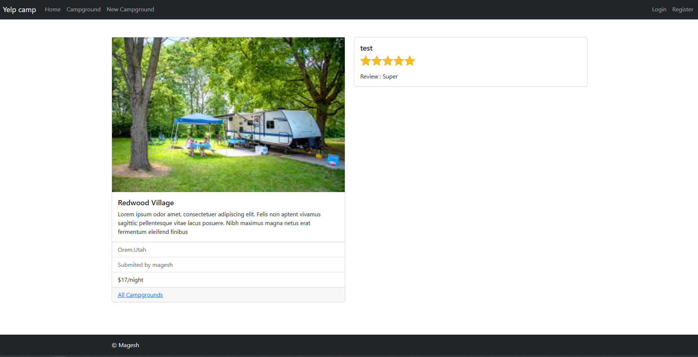

# 🏕️ YelpCamp



A full-stack web application for discovering, reviewing, and sharing campgrounds. Users can register, log in, create and manage campgrounds, upload images, and review other campgrounds. Built with Node.js, Express, MongoDB, and EJS, inspired by Colt Steele's Web Developer Bootcamp.

---

## 🚀 Features

- User authentication (register, login, logout)
- Create, edit, and delete campgrounds
- Upload multiple images for each campground (Cloudinary integration)
- Add, view, and delete reviews for campgrounds
- Flash messages for user feedback
- Server-side validation with Joi
- Responsive UI with Bootstrap 5
- MongoDB data storage with Mongoose
- Secure session management
- Input sanitization to prevent NoSQL injection

---

## 🛠️ Tech Stack

- **Backend:** Node.js, Express.js
- **Frontend:** EJS, EJS-Mate, Bootstrap 5
- **Database:** MongoDB, Mongoose
- **Authentication:** Passport.js, passport-local, passport-local-mongoose
- **File Uploads:** Multer, Cloudinary, multer-storage-cloudinary
- **Validation:** Joi
- **Session & Flash:** express-session, connect-flash
- **Security:** express-mongo-sanitize, dotenv

---

## 📦 Installation & Setup

1. **Clone the repository:**
   ```bash
   git clone <repo-url>
   cd YelpCamp
   ```

2. **Install dependencies:**
   ```bash
   npm install
   ```

3. **Set up environment variables:**
   Create a `.env` file in the root directory with the following variables:
   ```env
   CLOUDINARY_CLOUD_NAME=your_cloudinary_cloud_name
   CLOUDINARY_KEY=your_cloudinary_api_key
   CLOUDINARY_SECRET=your_cloudinary_api_secret
   NODE_ENV=development
   SESSION_SECRET=your_session_secret
   ```

4. **Start MongoDB:**
   Ensure MongoDB is running locally on `mongodb://localhost:27017/yelp-camp`.

5. **Seed the database (optional):**
   ```bash
   node seeds/index.js
   ```
   This will populate the database with sample campgrounds.

6. **Run the app:**
   ```bash
   npm run dev
   ```
   The server will start on [http://localhost:8000](http://localhost:8000).

---

## 🏗️ Project Structure

```
YelpCamp/
  |-- app.js
  |-- models/
  |-- controllers/
  |-- routes/
  |-- views/
  |-- public/
  |-- seeds/
  |-- utils/
  |-- cloudinary/
  |-- uploads/
  |-- schema.js
  |-- package.json
```

---

## 🗂️ Data Models

### User
- `username`: String (from passport-local-mongoose)
- `email`: String
- `password`: String (hashed)

### Campground
- `title`: String
- `images`: Array of { url, filename }
- `price`: Number
- `description`: String
- `location`: String
- `authur`: User reference
- `reviews`: Array of Review references

### Review
- `body`: String
- `rating`: Number (1-5)
- `authur`: User reference

---

## 🧑‍💻 Usage

- **Register/Login:** Create an account or log in to access all features.
- **Browse Campgrounds:** View all campgrounds on the index page.
- **Add Campground:** Click "New Campground" (must be logged in), fill out the form, and upload images.
- **Edit/Delete Campground:** Only the author can edit or delete their campgrounds.
- **Add Review:** On a campground's page, submit a review and rating.
- **Delete Review:** Only the review's author can delete their review.

---

## 🌐 Environment Variables

- `CLOUDINARY_CLOUD_NAME`: Your Cloudinary cloud name
- `CLOUDINARY_KEY`: Your Cloudinary API key
- `CLOUDINARY_SECRET`: Your Cloudinary API secret
- `NODE_ENV`: (optional) Set to `production` or `development`
- `SESSION_SECRET`: Secret for session encryption

---

## 🖼️ Preview


---

## 🙋 **Author & Contact**
**Author:** Magesh Balram

📧 **Email:** [mageshbalram@gmail.com](mailto:mageshbalram@gmail.com)

---

## 🙏 Inspiration
This project is inspired by [Colt Steele](https://www.coltsteele.com/) and his Web Developer Bootcamp curriculum. 